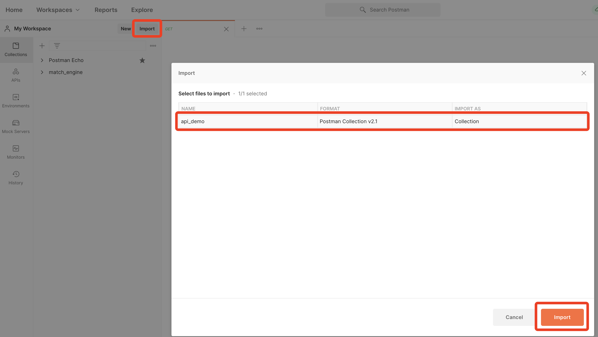
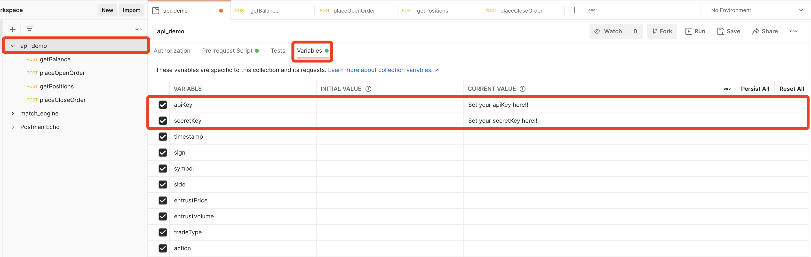
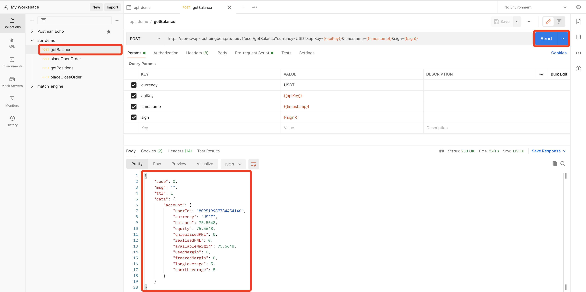
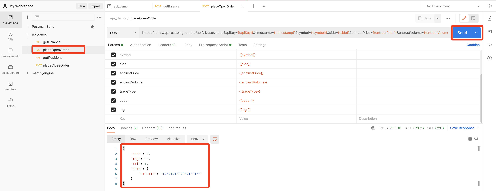
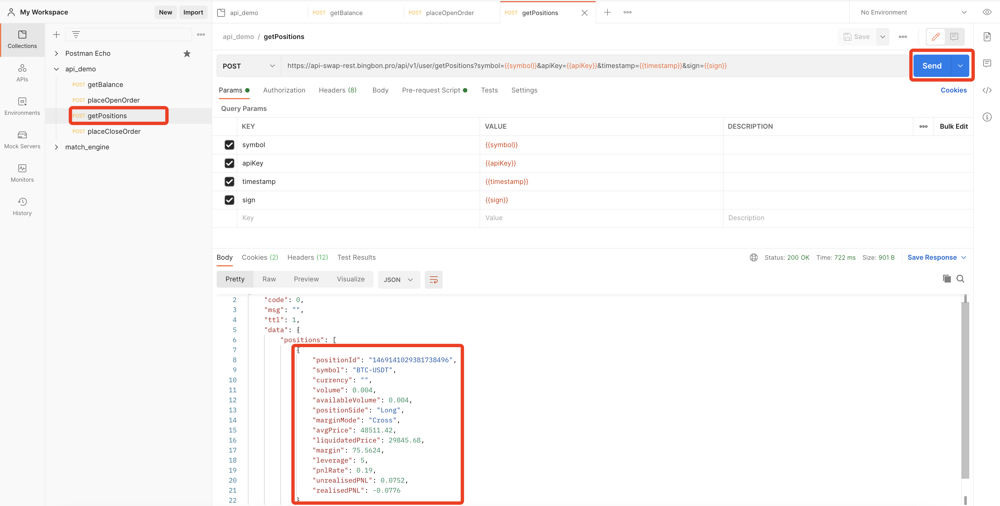

### Test API with postman 
1. Import [postman configuration](./postman/api_demo.postman_collection.json)
> 
2. Set `apiKey` and `secretKey`
> 
3. Test API `getBalance`
> 
4. Test API `trade`
> 
5. Test API `getPositions`
> 
